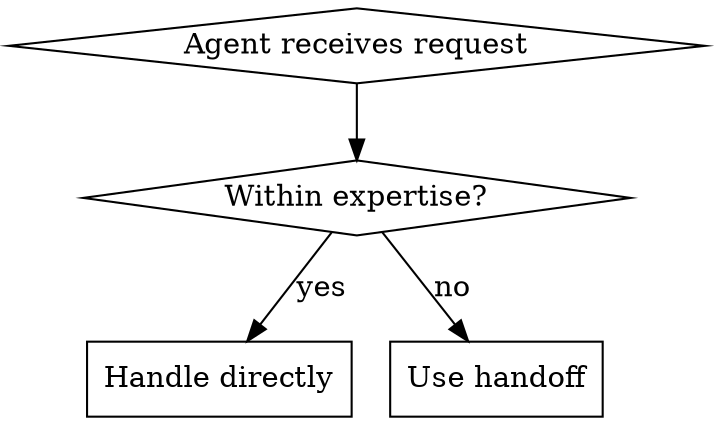

# Agent Orchestration with Handoffs

## Overview

Agent handoffs enable specialized agents to collaborate by transferring conversation control. When an agent encounters a request outside its expertise, it hands off to a more suitable agent while preserving conversation context.

**Core principle:** Each agent should have a focused purpose. Handoffs enable specialization while maintaining a coherent user experience.

## When to Use Handoffs



**Use handoffs when:**
- Agent lacks required tools or knowledge
- Request requires different specialization
- Human intervention is needed
- Task delegation would improve efficiency

**Don't use handoffs for:**
- Simple function calls (use tools instead)
- Subtasks the agent can handle itself
- Every request (creates unnecessary overhead)

## Handoff Pattern

### Basic Handoff

```typescript
import { Agent, handoff } from 'openai-agents-sdk';

// Create target agent
const specialistAgent = new Agent({
  name: 'specialist',
  instructions: 'You handle specialized technical issues.'
});

// Create handoff
const escalateToSpecialist = handoff({
  to: specialistAgent,
  description: 'Escalate to specialist when technical issues are beyond basic support'
});

// Use handoff in source agent
const generalAgent = new Agent({
  name: 'general',
  instructions: 'Handle general inquiries. Escalate when needed.',
  handoffs: [escalateToSpecialist]
});
```

### Handoff with Context Transfer

```typescript
const escalateWithContext = handoff({
  to: billingAgent,
  description: 'Transfer to billing for payment issues',
  // Pass additional context
  context: {
    reason: 'payment_processing',
    escalationLevel: 'tier1'
  }
});
```

## Multi-Agent Triage Pattern

The most common orchestration pattern: a triage agent routes to specialists.

```typescript
import { Agent, handoff, agents } from 'openai-agents-sdk';

// Triage agent - entry point
const triageAgent = new Agent({
  name: 'triage',
  instructions: `You are a triage agent. Your job is to understand the user's request
and route them to the appropriate specialist agent.

Analyze the request and:
- For product questions: handoff to productAgent
- For technical issues: handoff to technicalAgent
- For billing questions: handoff to billingAgent
- For account issues: handoff to accountAgent`,

  handoffs: [
    handoff({
      to: productAgent,
      description: 'Use for questions about products, features, or pricing'
    }),
    handoff({
      to: technicalAgent,
      description: 'Use for technical support, bugs, or integrations'
    }),
    handoff({
      to: billingAgent,
      description: 'Use for invoices, payments, or subscriptions'
    }),
    handoff({
      to: accountAgent,
      description: 'Use for account settings, credentials, or access'
    })
  ]
});

// Specialist agents
const productAgent = new Agent({
  name: 'product',
  instructions: 'You help with product information and recommendations.',
  tools: [productCatalog, comparisonTool]
});

const technicalAgent = new Agent({
  name: 'technical',
  instructions: 'You provide technical support and troubleshooting.',
  tools: [knowledgeBase, diagnosticTool, ticketCreator]
});

const billingAgent = new Agent({
  name: 'billing',
  instructions: 'You handle billing inquiries and payment processing.',
  tools: [invoiceLookup, paymentProcessor]
});

const accountAgent = new Agent({
  name: 'account',
  instructions: 'You help with account management and security.',
  tools: [accountManager, passwordReset]
});

// Run the triage system
const response = await agents.run({
  agent: triageAgent,
  message: 'I need to update my credit card'
});
```

## Handoff Best Practices

### 1. Clear Descriptions

The handoff description is critical—it tells the agent WHEN to use it.

```typescript
// ❌ Bad: Vague
handoff({
  to: supportAgent,
  description: 'Transfer to support'
})

// ✅ Good: Specific
handoff({
  to: technicalSupportAgent,
  description: 'Use when the user reports technical issues, bugs, or needs troubleshooting help beyond basic FAQ'
})
```

### 2. Target Agent Instructions

Target agents should understand they're receiving a handoff:

```typescript
const escalationAgent = new Agent({
  name: 'escalation',
  instructions: `You are an escalation specialist receiving escalated requests.
Acknowledge the handoff and provide expert assistance.
The user has already been helped by a general agent - focus on solving their specific issue.`
});
```

### 3. Context Preservation

Pass relevant context to maintain conversation continuity:

```typescript
const escalateWithContext = handoff({
  to: humanAgent,
  description: 'Escalate to human agent',
  context: (sourceContext) => ({
    conversationHistory: sourceContext.history,
    previousAttempts: sourceContext.attempts || 0,
    userId: sourceContext.userId
  })
});
```

### 4. Handoff Limits

Prevent infinite handoff loops:

```typescript
const generalAgent = new Agent({
  name: 'general',
  instructions: `Help users with their requests. You can escalate to specialists.

IMPORTANT: Only make ONE handoff per request. After receiving a handoff,
do NOT handoff again - handle the request yourself or inform the user you cannot help.`,
  handoffs: [escalationHandoff]
});
```

## Handoff Chaining

For complex workflows, chain handoffs sequentially:

```typescript
const level1Agent = new Agent({
  name: 'level1',
  instructions: 'Basic support',
  handoffs: [
    handoff({
      to: level2Agent,
      description: 'Escalate to level 2 when issue is unresolved'
    })
  ]
});

const level2Agent = new Agent({
  name: 'level2',
  instructions: 'Advanced support',
  handoffs: [
    handoff({
      to: specialistAgent,
      description: 'Escalate to specialist for complex cases'
    })
  ]
});
```

## Common Mistakes

| Mistake | Fix |
|---------|-----|
| Vague handoff descriptions | Be specific about WHEN to use |
| Too many handoffs | Keep agents focused, limit handoffs |
| Not preserving context | Pass relevant context in handoff |
| Handoff for everything | Use tools for function calls, handoffs for agent transfers |
| Circular handoffs | Design clear hierarchy or specialization boundaries |

## Testing Handoffs

Verify handoffs work correctly:

```typescript
// Test triage routing
const tests = [
  { input: 'How much does it cost?', expected: 'productAgent' },
  { input: 'I found a bug', expected: 'technicalAgent' },
  { input: 'I need a refund', expected: 'billingAgent' },
  { input: 'Reset my password', expected: 'accountAgent' }
];

for (const test of tests) {
  const result = await agents.run({
    agent: triageAgent,
    message: test.input
  });
  console.log(`${test.input} -> ${result.handoff?.to || 'no handoff'}`);
}
```

## For More Details

See `references/handoff-patterns.md` for advanced patterns including:
- Conditional handoffs
- Handoff callbacks and hooks
- Multi-agent consensus patterns
- Dynamic handoff routing
