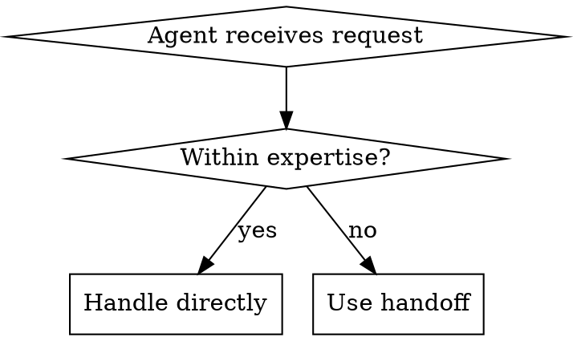

# Agent Orchestration with Handoffs

## Overview

Agent handoffs enable specialized agents to collaborate by transferring conversation control. When an agent encounters a request outside its expertise, it hands off to a more suitable agent while preserving conversation context.

**Core principle:** Each agent should have a focused purpose. Handoffs enable specialization while maintaining a coherent user experience.

## When to Use Handoffs



**Use handoffs when:**
- Agent lacks required tools or knowledge
- Request requires different specialization
- Task delegation would improve efficiency

**Don't use handoffs for:**
- Simple function calls (use tools instead)
- Subtasks the agent can handle itself
- Every request (creates unnecessary overhead)

## Handoff Pattern with @openai/agents

### Correct Import and Syntax

```typescript
import { Agent, handoff } from '@openai/agents';

// Create target agent
const specialistAgent = new Agent({
  name: 'specialist',
  instructions: 'You handle specialized technical issues.'
});

// Create handoff with correct syntax
const escalateToSpecialist = handoff(specialistAgent, {
  toolDescriptionOverride: 'Escalate to specialist when technical issues are beyond basic support'
});

// Use handoff in source agent
const generalAgent = new Agent({
  name: 'general',
  instructions: 'Handle general inquiries. Escalate when needed.',
  handoffs: [escalateToSpecialist]
});
```

**Critical syntax notes:**
- Use `handoff(agent, options)` - NOT `handoff({ to: agent, ... })`
- Use `toolDescriptionOverride` for clear routing
- Add handoffs to the `handoffs` array in Agent config

### Multi-Agent Triage Pattern

The most common orchestration pattern: a triage agent routes to specialists.

```typescript
import { Agent, handoff } from '@openai/agents';

// Triage agent - entry point
const triageAgent = new Agent({
  name: 'triage',
  instructions: `You are a triage agent. Your job is to understand the user's request
and route them to the appropriate specialist agent.

Analyze the request and:
- For product questions: handoff to productAgent
- For technical issues: handoff to technicalAgent
- For billing questions: handoff to billingAgent`,

  handoffs: [
    handoff(productAgent, {
      toolDescriptionOverride: 'Use for questions about products, features, or pricing'
    }),
    handoff(technicalAgent, {
      toolDescriptionOverride: 'Use for technical support, bugs, or integrations'
    }),
    handoff(billingAgent, {
      toolDescriptionOverride: 'Use for invoices, payments, or subscriptions'
    })
  ]
});

// Specialist agents
const productAgent = new Agent({
  name: 'product',
  instructions: 'You help with product information and recommendations.',
  tools: [productCatalog, comparisonTool]
});

const technicalAgent = new Agent({
  name: 'technical',
  instructions: 'You provide technical support and troubleshooting.',
  tools: [knowledgeBase, diagnosticTool]
});

const billingAgent = new Agent({
  name: 'billing',
  instructions: 'You handle billing inquiries and payment processing.',
  tools: [invoiceLookup, paymentProcessor]
});
```

## Tracking Handoffs with Streaming

When using streaming, you can track when handoffs occur:

```typescript
import { run } from '@openai/agents';

const streamResult = await run(triageAgent, 'I need to update my credit card', {
  stream: true
});

for await (const event of streamResult) {
  switch (event.type) {
    case 'agent_updated_stream_event':
      // Agent changed (handoff occurred)
      console.log(`[${event.agent.name}]`);
      break;

    case 'run_handoff_stream_event':
      // Handoff occurred - shows source and target
      console.log(`[handoff: ${event.currentAgent.name} → ${event.targetAgent.name}]`);
      break;

    case 'raw_model_stream_event':
      // Text delta from model
      if (event.data?.type === 'output_text_delta' && typeof event.data.delta === 'string') {
        process.stdout.write(event.data.delta);
      }
      break;
  }
}
```

## Handoff Best Practices

### 1. Clear Descriptions

The `toolDescriptionOverride` tells the agent WHEN to use the handoff.

```typescript
// ❌ Bad: Vague
handoff(supportAgent, {
  toolDescriptionOverride: 'Transfer to support'
})

// ✅ Good: Specific
handoff(technicalSupportAgent, {
  toolDescriptionOverride: 'Use when the user reports technical issues, bugs, or needs troubleshooting help beyond basic FAQ'
})
```

### 2. Target Agent Instructions

Target agents should understand they're receiving a handoff:

```typescript
const escalationAgent = new Agent({
  name: 'escalation',
  instructions: `You are an escalation specialist receiving escalated requests.
Acknowledge the handoff and provide expert assistance.
The user has already been helped by a general agent - focus on solving their specific issue.`
});
```

### 3. One Handoff Per Request Pattern

Prevent infinite handoff loops:

```typescript
const generalAgent = new Agent({
  name: 'general',
  instructions: `Help users with their requests. You can escalate to specialists.

IMPORTANT: Only make ONE handoff per request. After receiving a handoff,
do NOT handoff again - handle the request yourself or inform the user you cannot help.`,
  handoffs: [escalationHandoff]
});
```

### 4. Tool vs Handoff Decision

**Use tools when:**
- Calling a function or API
- Performing data transformation
- Accessing external systems

**Use handoffs when:**
- Transferring to another agent with different expertise
- The task requires fundamentally different capabilities
- You want to delegate the entire conversation

```typescript
// ✅ Tool: Function call
const lookupOrder = tool({
  description: 'Look up order status',
  parameters: z.object({ orderId: z.string() }),
  execute: async ({ orderId }) => {
    return JSON.stringify(await db.lookupOrder(orderId));
  }
});

// ✅ Handoff: Agent transfer
const escalateToBilling = handoff(billingAgent, {
  toolDescriptionOverride: 'Use for billing disputes, payment issues, or refund requests'
});
```

## Common Mistakes

| Mistake | Fix |
|---------|-----|
| Wrong syntax `handoff({ to: agent })` | Use `handoff(agent, { toolDescriptionOverride })` |
| Vague descriptions | Be specific about WHEN to use |
| Too many handoffs | Keep agents focused, limit handoffs |
| Handoff for function calls | Use tools for functions, handoffs for agents |
| Circular handoffs | Design clear hierarchy or specialization boundaries |
| Not tracking handoffs in streaming | Use `run_handoff_stream_event` |

## Testing Handoffs

Verify handoffs work correctly:

```typescript
import { run } from '@openai/agents';

// Test triage routing
const tests = [
  { input: 'How much does it cost?', expected: 'productAgent' },
  { input: 'I found a bug', expected: 'technicalAgent' },
  { input: 'I need a refund', expected: 'billingAgent' }
];

for (const test of tests) {
  const streamResult = await run(triageAgent, test.input, { stream: true });

  // Track which agents were used
  const agentsUsed = [];
  for await (const event of streamResult) {
    if (event.type === 'agent_updated_stream_event') {
      agentsUsed.push(event.agent.name);
    }
  }

  console.log(`${test.input} -> ${agentsUsed.join(' -> ')}`);
}
```

## For More Details

See `references/handoff-patterns.md` for advanced patterns including:
- Dynamic handoff routing
- Handoff with context preservation
- Multi-agent consensus patterns
